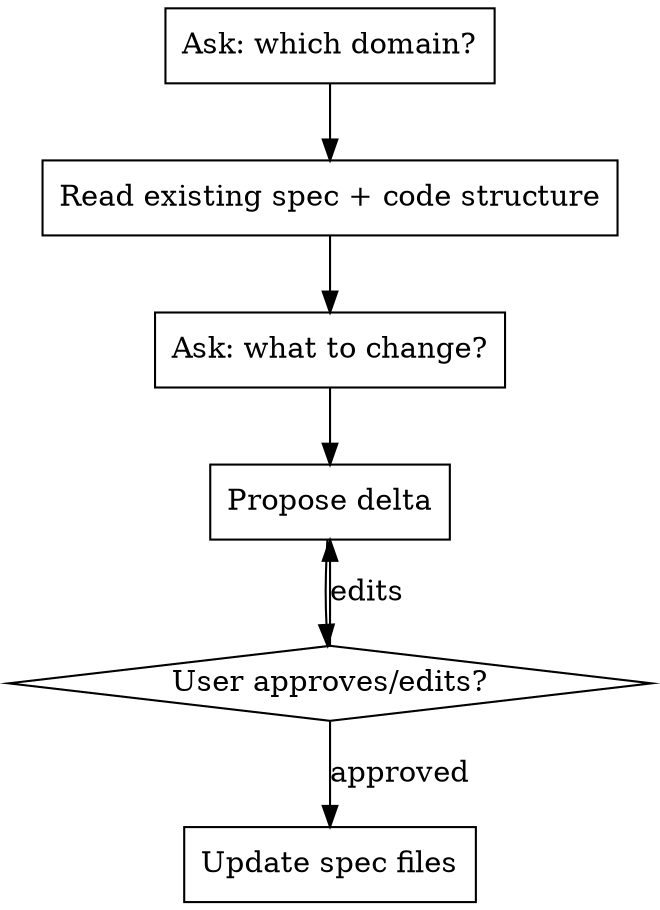

# MemeApp Domain Spec Update

## Overview

Interactive process: identify domain → read existing spec + code → ask what changes → propose delta → get approval → update spec files.

**Do NOT change code until spec delta is approved.**

## Process



## Step 1 — Identify Domain

Ask: **"Какой домен обновляем?"**

Then read:
- `.claude/knowledge/project/domains/<name>/README.md` (and sub-files if split)
- `src/dotnet/Domains/<Name>/MemeApp.<Name>.Contracts/` — actual current structure

Both sources together give the full picture. Spec may be ahead of code (planned) or code may have diverged.

## Step 2 — Ask What Changes

Ask: **"Что добавляем или меняем?"** — open-ended, let user describe in their own words.

Classify the change(s):

| Type | Examples |
|------|---------|
| New aggregate | "добавь сущность Playlist" |
| New field on existing aggregate | "добавь поле Description к Meme" |
| Modified field | "переименуй Title → Name", "сделай SourceUrl обязательным" |
| Removed field | "убери FilePath — больше не нужно" |
| New operation on existing aggregate | "добавь ListByMediaType" |
| New event | "хочу событие когда мем удаляется" |
| Modified operation | "переименуй AddAsync → CreateAsync" |
| Removed operation | "убери UpdateAsync, обновлять не нужно" |

Multiple changes in one session are fine — collect all, then propose together.

## Step 3 — Propose Delta

Show only what changes — not the full spec. Format:

```markdown
### Изменения в спеке

**Новый агрегат: Playlist**
- Fields: Id (PlaylistId), Name (string), Memes (ImmutableList<MemeId>), CreatedAt (DateTime)
- Queries: GetAsync(id), ListAsync()
- Commands: AddAsync, UpdateAsync, DeleteAsync, AddMemeAsync, RemoveMemeAsync
- Events: —

**Новая операция: IMemeBackendService**
- `ListByMediaTypeAsync(MediaType mediaType)` → `ImmutableList<Meme>`

**Изменение полей: Meme**
- Добавить: `Description (string?)` — краткое описание мема
- Удалить: `FilePath` — хранение файлов вынесено
- Переименовать: `Title` → `Name`
```

For new aggregates, propose fields based on context (same rules as `memeapp-domain-spec` Step 3).

Then ask: **"Предложенные изменения выше. Что скорректировать?"** Wait for approval.

## Step 4 — Update Spec Files

Apply delta to existing spec files. Rules:

- **New aggregate** → add new section to README.md (or new sub-file if spec is split, with link from README)
- **New operation** → add line to existing aggregate's Queries or Commands section
- **New event** → add to existing Events section (or create Events section if absent)
- **Modified operation** → update in place
- **Removed operation** → delete the line

Keep untouched sections exactly as they are. Don't reformat or rewrite existing content.

## Rules

- Propose only what the user asked for — don't suggest unrelated additions
- For new aggregates: infer fields from context, show in proposal
- Spec is the source of truth — if code diverged, update spec to reflect intent, not current code
