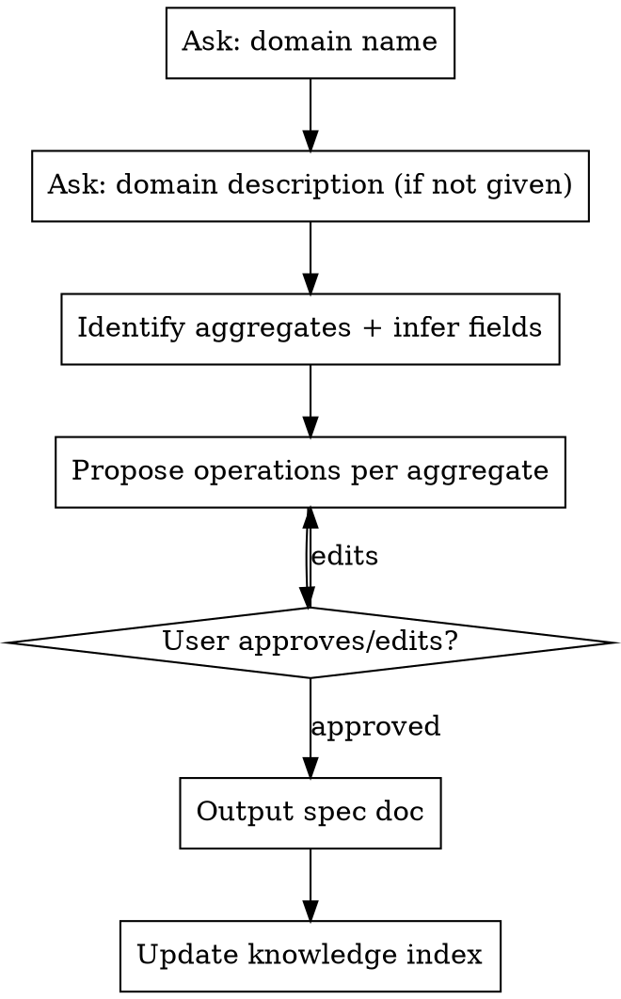

# MemeApp Domain Spec

## Overview

Interactive process: ask domain name → gather/infer description and aggregates → propose operations → get user approval → output spec doc.

**Do NOT write code or create files until spec is approved.**

## Process



## Step 1 — Domain Name

Ask: **"Как называется домен? (например: Memes, Payments, Notifications)"**

Domain name = PascalCase plural noun. Used as folder name and project prefix.

## Step 2 — Gather Context + Description

Read `.claude/knowledge/project/domains/` (existing domain specs) and `Domains/` source to understand the broader model.

If the user hasn't described the domain purpose, ask: **"Опиши домен в 1-2 предложениях — что он моделирует?"**

## Step 3 — Identify Aggregates + Infer Fields

Primary aggregate = main entity named after the domain (singular). Related aggregates = entities with own lifecycle.

For each aggregate, **propose fields** based on domain description and broader context. Don't ask the user to list fields — infer them and show in the proposal.

Example inferences:
- A "media" entity → likely has `MediaType`, `SourceUrl`, `FilePath`, `CreatedAt`
- A "label/tag" entity → likely has `Name`, `Slug` (URL-safe unique)
- A "group/collection" entity → likely has `Name`, `Description?`, membership relation

IDs: every aggregate has a strongly typed `<Name>Id` (record struct wrapping Guid).

## Step 4 — Propose Operations

For each aggregate propose:
- **Queries** (`[ComputeMethod]`, reactive): Get by id, List, List by filter
- **Commands** (mutations): Add, Update, Delete + domain-specific (AddTag, AddToCollection, etc.)
- **Events** (`EventCommand`): raised after commands when other parts of the system should react (e.g., `MemeAddedEvent`, `MemeDeletedEvent`)

Events are optional — only propose if the domain clearly needs cross-aggregate or cross-domain reactions.

`DeleteAsync` returns nothing (`Task`, no result). Commands that mutate relations (AddTag, RemoveTag) also return nothing unless the updated aggregate is needed.

Lean toward fewer operations. No Search/Paginate/Bulk unless explicitly needed.

Then show full proposal and ask: **"Операции предложены выше. Что убрать, добавить или переименовать?"** Wait for approval.

## Step 5 — Output Spec Doc

Save to `.claude/knowledge/project/domains/<domain-name>/README.md`.

If large, split per aggregate and link from README:

```
.claude/knowledge/project/domains/<domain-name>/
  README.md       ← overview + navigation table
  meme.md         ← Meme aggregate
  tag.md          ← Tag aggregate
```

Navigation table:
```markdown
| File | Contents |
|------|----------|
| [meme.md](meme.md) | Meme aggregate — fields, queries, commands |
```

Spec format:

```markdown
# Domain Spec: <DomainName>

## Aggregates
- <PrimaryAggregate> — <one-line purpose>
- <RelatedAggregate> — <one-line purpose>

## <PrimaryAggregate>

### Fields
| Field | Type | Notes |
|-------|------|-------|
| Id | <Name>Id | Strongly typed, wraps Guid |
| ... | ... | ... |

### Queries
- `GetAsync(id)` → `<Name>?`
- `ListAsync()` → `ImmutableList<<Name>>`
- `ListBy<Filter>Async(filter)` → `ImmutableList<<Name>>`

### Commands
- `AddAsync(Add<Name>Command)` → `<Name>`
- `UpdateAsync(Update<Name>Command)` → `<Name>`
- `DeleteAsync(Delete<Name>Command)` → (none)
- <domain-specific commands>

### Events (if any)
- `<Name>AddedEvent` — raised after Add, carries `<Name>Id`
- `<Name>DeletedEvent` — raised after Delete, carries `<Name>Id`

## <RelatedAggregate>
...
```

## Step 6 — Update Knowledge Index

Add a row to `.claude/knowledge/project/README.md`:

```markdown
| [domains/<name>/README.md](domains/<name>/README.md) | <Name> domain spec — aggregates, operations |
```

## Rules

- Strongly typed IDs: `<Name>Id` — `readonly record struct` wrapping Guid
- Return types are **aggregates** (no DTO suffix) — e.g., `Meme`, not `MemeDto`
- `DeleteAsync` and relation-mutation commands return nothing (`Task`)
- Events (`EventCommand`) only if cross-aggregate/cross-domain reactions are needed
- Don't add operations "for the future" — only what the spec explicitly needs
